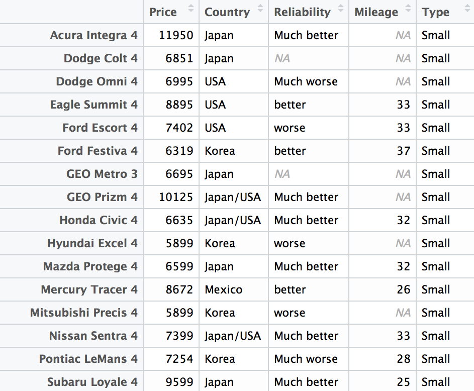

## 孫玉峰｜Summit Suen {.columns-2}


### 課程經理／講師＠木刻思

### Taiwan R User Group Co-Organizer

### 學術 => 業界

### 相信資料跟數學會改變世界

## 現在對於資料科學的面貌，有沒有更瞭解了呢？ {.flexbox .vcenter}

- 資料科學`「不等於」`大數據
- 資料科學 `v.s.` 資料工程
- 

# 我們怎麼做決定？

## {.fullpage}


## {.fullpage}

 

# 數據驅動－以資料輔助決策

## {.fullpage}

 

# 說到決策樹之前－來談談條件機率

## 機率與條件機率 {.columns-2}


- 事件Ａ發生的機率 = `P(A)`
- 事件Ｂ發生的機率 = `P(B)`
- 事件Ａ與Ｂ同時發生的機率 = `P(A & B)`
- 事件Ｂ發生時，事件Ａ發生的機率 = `P(A|B) = P(A & B) / P(B)`

# 再回來看「擲筊」這件事


## 是怪力亂神還是冥冥中自有註定？

擲筊是一種道教信仰問卜的儀式，普遍流傳於華人民間傳統社會。「筊杯」是一種占卜工具⋯⋯儀式內容是將兩個約掌大的半月形，一面平坦、一面圓弧凸出之筊杯擲出，以探測神鬼之意。—— [維基百科](https://zh.wikipedia.org/zh-tw/%E6%93%B2%E7%AD%8A)


- 擲筊有4種組合：哭筊（平平）、聖筊（平凸）、聖筊（凸平）、笑筊（凸凸）。
- 假設每種組合出現的可能性相同，則每一種的機率皆為 `100%/4 = 25%`。

## 是怪力亂神還是冥冥中自有註定？

直覺上，擲出聖筊的機率是 `平凸` 與 `凸平` 兩種組合出現的頻率，`25% × 2 = 50%`。

根據[行天宮的官方資料](http://www.ht.org.tw/re3-9.html)，笑筊表示信眾陳述不清，可仔細思考後重新向神明請示。

```{r, eval=FALSE}

   __ [1/2] # 聖筊
  /
__|__  1/4  # 哭筊
  |
  \__  1/4  # 笑筊

```

這麼一來，`擲出聖筊的機率`會不會有所改變呢？

## 是怪力亂神還是冥冥中自有註定？

第一次擲出聖筊的機率是 1/2。
第一次擲出笑筊、進入第二輪的機率是 1/4。

因此，「第二輪擲出聖筊」的機率便成了 `1/4 × 1/2 = 1/8`。

```{r, eval=FALSE}

   __  1/2 
  /
__|__  1/4     __ [1/2] # 聖筊
  |           /
  \__ [1/4] __|__  1/4  # 哭筊
              |
              \__  1/4  # 笑筊

```

如此一來，兩輪內擲出聖筊的機率為 `1/2 + 1/8 = 5/8 = 62.5%`。

## 是怪力亂神還是冥冥中自有註定？

依此類推

> - `P(前兩輪都擲出笑筊)× P(第三輪擲出聖筊) = (1/4×1/4)×1/2 = 1/32`。

> - `P(前三輪都擲出笑筊)× P(第四輪擲出聖筊) = (1/4×1/4×1/4)×1/2 = 1/128`。

> - 我們會得到一個無窮等比級數：首項 = 1/2，公比 = 1/4。

```{r, echo=FALSE}
library(MASS)
fractions(1/2*(1/4)^c(0:6), max.denominator = 10000000)
sum(1/2*(1/4)^c(0:6))
```

- 根據公式：`無窮等比級數和 = 首項/(1-公比) `，可以計算出擲出聖筊的機率是 `1/2/(1-1/4) = 2/3 = 67%`。

- 擲出聖筊，比你想的還容易！

# 條件機率與決策樹

## 情境題：食安風暴

```{r, eval=FALSE}
"
                     __P(D |A )__ [D ]
   __P(A )__ [A ] __/
  /                 \__P(D'|A )__ [D']
__|
  |                  __P(D |A')__ [D ]
  \__P(A')__ [A'] __/
                    \__P(D'|A')__ [D']
"
```

當食安風暴來襲，大眾對於「食品」的安全與否特別重視，購買之前也都會特別注意商品是否有經過檢驗。

今天某Ｃ食品公司有一款新油品要上市，已知食藥署對該商品檢驗合格的機率為 `60%`。而若檢驗合格的話，銷量會成長兩倍的機率有`八成`；反之若沒有檢驗合格，則銷量要成長兩倍的機率只有 `1/4`。

## 情境題：食安風暴

```{r, eval=FALSE}
"
                            __P(D |A ) = 0.80__ [D ] => P(D , A )
   __P(A ) = 0.60__ [A ] __/
  /                        \__P(D'|A ) = 0.20__ [D'] => P(D', A )
__|
  |                         __P(D |A') = 0.25__ [D ] => P(D , A')
  \__P(A') = 0.40__ [A'] __/
                           \__P(D'|A') = 0.75__ [D'] => P(D', A')
"
```

- 則銷量成長兩倍的機率為 `P(D ) = P(D , A ) + P(D , A') = 0.60 × 0.80 + 0.40 × 0.25 = 0.48 + 0.10 = 0.58`。

- 銷量不會成長兩倍的機率 `P(D') = P(D', A ) + P(D', A') = 0.60 × 0.20 + 0.40 × 0.75 = 0.12 + 0.30 = 0.42`。

## 情境題：食安風暴

```{r, eval=FALSE}
"
                            __P(A |D )__ [A ]
   __P(D ) = 0.58__ [D ] __/
  /                        \__P(A'|D )__ [A']
__|
  |                         __P(A |D')__ [A ]
  \__P(D') = 0.42__ [D'] __/
                           \__P(A'|D')__ [A']
"
```

反過來，我想知道某Ｃ食品公司的這款新油品有沒有被食藥署檢驗合格？

- 計算各種情境的條件機率。

- 其實前面已經出現過`分子`跟`分母`了！根據條件機率的公式可以直接算出。

## 情境題：食安風暴

```{r, eval=FALSE}
"
                            __P(A |D )__ [A ] => P(D , A ) = 0.48
   __P(D ) = 0.58__ [D ] __/
  /                        \__P(A'|D )__ [A'] => P(D , A') = 0.10
__|
  |                         __P(A |D')__ [A ] => P(D', A ) = 0.12
  \__P(D') = 0.42__ [D'] __/
                           \__P(A'|D')__ [A'] => P(D', A') = 0.30
"
```

- `P(A |D ) = 0.48 / 0.58 = 0.828`

- `P(A'|D ) = 0.10 / 0.58 = 0.172`

- `P(A |D') = 0.12 / 0.42 = 0.286`

- `P(A'|D') = 0.30 / 0.42 = 0.714`

## 決策樹的建構

- 從`條件機率`建構

- 分類樹：當結果可能為離散（例如三個種類的花，輸贏等）使用的概念。

- 回歸樹：當結果可能為實數（例如房價，患者住院時間等）使用的概念。

- CART：Classification And Regression Trees

- 從`資料`建構

- 熵（Entropy） = 系統的凌亂程度，演算法 `ID3`, `C4.5` 和 `C5.0` 使用熵。可以視為是系統資訊量的度量。

- 

## 決策樹的實現 {.columns-2}



> - 117 筆紀錄，5 個變數欄位。

> - 1990 年四月製造的車輛資料。

> - Reliability：`Much worse` < `worse` < `average` < `better` < `Much better`。

> - Mileage：每加侖可走里程數。

- 想知道價格如何決定？

## 決策樹的實現

```{r}
library(rpart)
fit <- rpart(Price ~ Mileage + Type + Country, cu.summary)
par(xpd = TRUE); plot(fit, compress = TRUE); text(fit, use.n = TRUE)
```

# 暖身一下，準備來寫程式囉！

## 談到資料科學－最熱門的程式語言 {.columns-2}


- 專門為資料分析設計的語言。

- 免費、開源、豐富的社群資源。

- 容易擴充並且與其他工具整合。

- 強大的視覺化功能。

## 環境設定＆介紹 {.columns-2}

<iframe width="560" height="315" src="https://www.youtube.com/embed/videoseries?list=PLLSknrdOLKyExmSXobXQebQUg2kESYGIe" frameborder="0" allowfullscreen></iframe>

- 主程式：[R](https://www.r-project.org/)（R-3.2.3 以上版本）
- 編輯界面：[RStudio IDE](https://www.rstudio.com/products/rstudio/download/)（0.99.491 以上版本）

## 環境設定＆介紹 {.columns-2}

### 命令列區


程式的`輸入`、`輸出`、`中斷`

- 當左下角的符號為 `>` 表示可以輸入指令。
- 輸入 `1 + 1` 後按下 Enter，檢查螢幕輸出。
- 輸入 `1 +` 後按下 Enter，檢查螢幕輸出。
- 最左下角的開頭變成 `+` 表示尚未輸入完成，應繼續輸入。
- 按下 ESC，會中斷執行中的程式 (左下角回復成 `>` 開頭)。

## 環境設定＆介紹 {.columns-2}

### 程式碼編輯區


停留時間最多的區域

- New File -> R Script -> Untiled1.R
- 在程式碼編輯區中輸入 `1 + 1` 後按下 Control + Enter，檢查 `命令列區`。
- 在程式碼編輯區中輸入 `1 +` 後按下 Control + Enter，檢查 `命令列區`。
- 在命令列區按下 ESC 中斷程式。

## 環境設定＆介紹 {.columns-2}

### 檔案系統區（說明＆圖表）


### 環境資訊區


## 基礎Ｒ語法

### 敘述句

```{r}
1 + 1
x <- 10
y <- 4
(x + y)/2
```

## 基礎Ｒ語法

### 向量（數列）

```{r}
c(1:4)
1:4
4:1
```

## 基礎Ｒ語法

### 有序的數值向量

```{r}
seq(1:4)
seq(1, 9, by = 2)
seq(1, 10, length.out = 5)
```

## 基礎Ｒ語法

### 向量運算（recycling properties）

```{r}
c(1, 2, 3) * c(2, 2, 2)
1:3 * 2
c(0.5, 1.5, 2.5, 3.5) * c(2, 1)
```

## 基礎Ｒ語法

### 向量取值

```{r}
x <- c(174, 158, 160, 168, 173)
x[1]
x[c(1, 3)]     # 選取第1, 3個位置的元素
```

## 基礎Ｒ語法

### 向量取值

```{r}
x[c(2, 3, 1)]  # 依序取值
x[-1]          # 在[ ]中使用負號 (-) 做反向選取
x > 160
```

## 基礎Ｒ語法

### 向量取值

```{r}
index <- which(x > 160) # 使用比較運算子 加上 `which` 函數進行取值
index
x[index]
x[which(x > 160)]
```

## 基礎Ｒ語法

### 向量取代與新增

```{r}
# 利用 [ ] (中括號) 與 <- (箭號) 進行元素的取代與新增
x <- c(174, 158, 160, 168, 173)
x[c(1, 5)] <- 175
x
x[x > 160] <- 170
x
```

## 基礎Ｒ語法

### 向量取代與新增

```{r}
x <- c(174, 158, 160, 168, 173)
x[6] <- 168
x
x[8] <- 147
x # 未指定的元素值預設為NA
```

## 基礎Ｒ語法

### 向量取代與新增

```{r}
length(x) # 查看向量物件的長度
x[length(x) + 1] <- 166 # 接續增加新元素
x
```

## 基礎Ｒ語法

### 基礎字串處理

```{r}
x <- "scu"; y <- "taipei"; paste(x, y, sep=",") # 字串的剪接：paste
strsplit(x, "c")                                # 字串的切割：strsplit
name1 <- "東吳大學"; substring(name1, 1, 2)     # 截取子字串：substring
```

## 不基礎Ｒ語法

### 資料處理 `dplyr` ＋視覺化 `ggplot2`

```{r}
# install.packages("Lahman")
# install.packages("ggplot2")
# install.packages("dplyr")
library(Lahman)
library(ggplot2)
library(dplyr)
```

## 不基礎Ｒ語法

### 資料處理 `dplyr` ＋視覺化 `ggplot2`

```{r}
totalRS <- Teams %>% select(yearID, R, G) %>% mutate(AvgRperG = R/G) %>% group_by(yearID) %>% summarise(sum(AvgRperG))
names(totalRS) <- c("yearID", "RUN")
head(totalRS)
```

## 不基礎Ｒ語法

### 資料處理 `dplyr` ＋視覺化 `ggplot2`

```{r, fig.width=10, fig.height=4}
ggplot(data = totalRS, aes(x = yearID, y = RUN)) + stat_smooth() + geom_line()
```

## Ｑ＆Ａ

### 對於以上內容，有任何問題嗎？

### 也可以在[共筆](https://hackpad.com/HF6ivFssLp4)發問喔！

### 如果對Ｒ有興趣，也可以到我們的[論壇](http://data-sci.info/)尋找更多資訊。

## 參考資料 {.smaller}

> - [圖片來源](http://bigsonata.com/lam-sao-de-tro-thanh-nha-khoa-hoc-du-lieu/)
> - [圖片來源](http://www.astro.ucla.edu/~wright/statistics/)
> - [【數學力】神啊！請給我一個聖筊](http://opinion.udn.com/opinion/story/8159/1317267-%E3%80%90%E6%95%B8%E5%AD%B8%E5%8A%9B%E3%80%91%E7%A5%9E%E5%95%8A%EF%BC%81%E8%AB%8B%E7%B5%A6%E6%88%91%E4%B8%80%E5%80%8B%E8%81%96%E7%AD%8A)
> - [台灣資料科學愛好者年會 2014 R Tutorial](https://github.com/TaiwanRUserGroup/DSC2014Tutorial)
> - [台灣資料科學愛好者年會 2015 R Tutorial](https://github.com/TaiwanRUserGroup/DSC2015Tutorial)
> - [Mini R Workshop](http://suensummit.github.io/miniRWorkshop-201511/)
> - [TryR](http://tryr.codeschool.com/)
